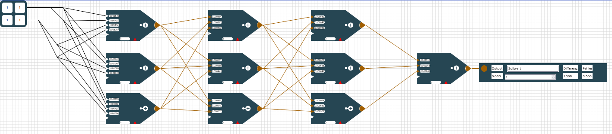

# ProjektpraktikumSoSe2022 

# Benutzerhandbuch

In der unteren Abbildung siehst du Benutzeroberfläche von NECK - dem Network Construction Kit!

Mit dieser Website lernst du spielend leicht die Grundlagen von Neuronalen Netzen die seit Jahren neue Spitzenleistungen erzielen. Egal ob Bild oder Spracherkennung - die Durchbrüche sind riesig.

## Die Oberfläche

Ein Neuronales Netz ist angelehnt an das menschliche Gehirn. In der Mitte der Website siehst du ein Gitterraster auf dem verschiedene Bausteine mit Linien verbunden sind.

#### Das Raster - erste Orientierung

In diesem Abschnitt werden nur die einzelnen Elemente auf dem Raster benannt. Die Elemente selbst werden in einem 
folgenden Abschnitt detailliert erklärt. 

Links oben ist eine **Eingabetabelle (Eingabematrix) **. In dieser Matrix sind Eingabedaten gespeichert mit denen dein neuronales Netz lernen soll. 

Diese Eingabetabelle ist mittels Linien mit **Neuronen** verbunden. Die Neuronen sind die Fünfecke mit den kleinen Textfeldern und der bunten Spitze. In der unteren Abbildung sind 3 Neuronen zu sehen. 

Rechts unten siehst du eine **Farbskala**. 

Unter der Farbskala sind **Zoom Knöpfe**.  Links für heraus, in der Mitte für reinzoomen. Mit dem rechten Knopf kommst du wieder zum Standardzoom zurück. 

Zoomst du heraus wirst du rechts neben den Neuronen auch einen **Ergebnis - Output (Ausgabe)** sehen. Mit Output ist das gesamte Rechteck gemeint.

#### Die linke Sidebar - Werkzeuge

In der linken Sidebar findest du alles um dein Netz zu erstellen und zu verändern. Wenn du auf **Verschieben** klickst hast du dieses Werkzeug aktiviert. Klickst du auf ein

- die Eingabematrix
- ein Neuron 
- oder einen Output

und hälst die Maus gedrückt, so kannst du die Elemente beliebig auf dem Raster verschieben. Die Linien verschieben sich automatisch mit.

Klickst du auf **Neuron erstellen** aktivierst du damit dieses Werkzeug. Immer wenn du danach auf das Raster klickst erstellst du ein neues Neuron. Dieses Neuron ist aber noch nicht mit einem anderen Element auf dem Raster verbunden (also noch sinnlos).

> ⚠️ Wenn du mehrmals auf die gleiche Stelle klickst erstellst du jedes mal ein neues Neuron auch wenn du es nicht direkt siehst. Klickst du anschließend aber auf Verschieben wirst du merken, dass du mehrere Neuronen erstellt hast.

 Klickst du auf **Output erstellen** erstellst du mit jedem Klick auf das Raster einen Output.

Ein **Output** ist im Gegensatz zum Ergebnis-Output ein kleines Rechteck mit nur einer Zahl.

Im oberen Bild siehst du rechts ein kleines Rechteck mit einem grünen Kreis und einer 5 darin. Das ist ein Output. 

  

> ⚠️  Ein Output und ein Ergebnis Output sind unterschiedliche Elemente! Eine nähere Erklärung  zu den Elementen findest du im Abschnitt "Detaillierte Erklärung der Elemente"

Mit dem Button **Ergebnis-Output** erstellst du immer wenn du auf das Raster klickst einen Ergebnis-Output. (Ein Ergebnisoutput war das große Rechteck im zweiten Bild. Er enthält 4 Zahlen und ist deutlich größer als ein normaler Output)  

Mit dem Button **Verknüpfen** erstellst du **Linien** zwischen zwei Elementen auf dem Raster. Du kannst 

-  Eingabematrix - Neuron (nur diese Richtung)
- Neuron - Neuron
- Neuron - Output (nur diese Richtung
- Neuron - Ergebnis-Output (nur diese Richtung)

verbinden. 

Die Linie verläuft vom zuerst angeklickten Element zum zweit-angeklickten Element.

Dabei kann eine Eingabematrix mit mehreren Neuronen verbunden sein. Ein Neuron kann mit beliebig vielen anderen Neuronen verbunden sein. Aber es dürfen keine Kreise zwischen den Neuronen gebaut werden! Ein Neuron kann nur entweder mit einem Output oder mit einem Ergebnis-Output verbunden sein. Ein Output kann auch nur mit genau einem Neuron verbunden sein, genau so wie ein Ergebnis-Output. 

Willst du eine Eingabematrix mit einem Neuron manuell verbinden, so klickst du zuerst auf das Feld der Eingabematrix das du verbinden willst und dann auf das Neuron. Wichtig ist, dass du auf ein spezifisches Feld (eine Zahl in der Eingabetabelle) der Eingabematrix klicken musst. Du kannst nicht auf einmal eine ganze Matrix mit einem Neuron verbinden.  

> ⚠️ Achte auf die Reihenfolge beim Verbinden von Elementen. Kreise zu bauen wird vom Programm verboten.

Mit dem **Entfernen** Button aktivierst du dieses Werkzeug. Alles was du auf dem Raster anklickst wird gelöscht (außer der Eingabematrix - diese musst du in der rechten Sidebar löschen - siehe Abschnitt "rechte Sidebar").  Du kannst einzelne Linien zwischen den Elementen aber auch einzelne Neuronen, einzelne Outputs oder einzelne Ergebnis-Outputs löschen. 

Mit dem **Gewichte-Sperren** Button kannst du einzelne Gewichte von Neuronen sperren indem du sie anklickst. Diese Gewicht werden dann rot hinterlegt und werden beim Training nicht angepasst. Dies ist aber ein Werkzeug, dass du am Anfang wahrscheinlich nicht brauchst. 

Der **Netz-Sortieren** Button wird dein neuronales Netz automatisch schön übersichtlich sortiert. Die Eingabematrix wird nach ganz links verschoben und die Ergebnis-Outputs nach ganz rechts. Die Neuronen werden in verschiedenen Ebenen, sogenannten Layern angeordnet. Ist Neuron A mit Neuron B von A nach B mit einer Linie verbunden, so ist Neuron A links von Neuron B. Normale Outputs werden direkt neben ihr verbundenes Neuron verschoben. Elemente die nicht mit der Eingabematrix oder einem Ergebnis-Output verbunden sind werden automatisch gelöscht.

> ⚠️ Beachte, dass beim Netz sortieren unnötige Elemente gelöscht werden!

Mit dem **Netz löschen** Button löschst du alles (außer der Eingabematrix) auf dem Raster. Es werden also alle Neuronen, alle Outputs, alle Ergebnis-Outputs und alle Linien dazwischen gelöscht.

Mit dem  **Vorhersagen-Button** aktualisierst du die Ausgabe an den Ergebnis-Outputs. Manchmal kann es sein, dass du Werte in der Eingabematrix oder in den Neuronen von Hand änderst. Dann ändert sich  der Ergebnis-Output <u>nicht</u> automatisch mit. Klickst du jedoch auf den Vorhersage-Button wird alles richtig angezeigt. 

> ⚠️ Ganz am Anfang beim Öffnen der Website ist der Ergebnis Output nicht aktualisiert!

#### Die rechte Sidebar

Rechts neben dem Raster siehst du die rechte Sidebar, die im oberen Foto dargestellt ist. Hier siehst du die **Eingabematrizen** farblich dargestellt. Jedes farbliche Viereck steht für eine Eingabematrix. Je heller die Felder einer Eingabematrix gefärbt sind, desto kleiner sind die Werte in ihr. Im oberen Foto siehst du beispielsweise drei Eingabematrizen, wobei die erste nur 0en enthält, die zweite nur 1en und die dritte nur 2en. Dementsprechend sind die Eingabematrizen eingefärbt.

Im Regelfall hast du in einer Eingabematrix viele verschiedene Werte. Die untere Matrix hat enthält zum Beispiel die Zahlen -1, 1, 2, 3

Unter jeder Eingabematrix siehst du links einen **Anzeige Button** und rechts einen **Löschen-Button**. Klickst du auf den Anzeige Button wird diese Eingabematrix auf dem Raster angezeigt und du kannst im Ergebnis-Output ablesen wie gut diese spezifische Matrix/ dieses spezifische Beispiel gelernt wurde. Hier wird der Ergebnis-Output tatsächlich mit dem Anzeigen immer aktualisiert und du musst nicht nochmal extra auf "Vorhersagen" klicken. 

Mit dem Löschen Button löschst du die Eingabematrix komplett. Das heißt sie wird nicht nur nicht mehr angezeigt, sondern ist komplett weg! 

> ⚠️ Die aktuell angezeigte Matrix kannst du nicht löschen, weil immer mindestens eine Matrix existieren muss!

Ganz unten in der rechten Sidebar ist ein Button **"hinzufügen"** mit dem du neue Matrizen erstellen kannst. Klickst du darauf wird automatisch eine neue Eingabematrix in der gleichen Größe wie die bisherigen erstellt die nur 1en enthält. Willst du die Eingabewerte der Matrix ändern, musst du mit dem Anzeigen Button die Matrix auf dem Raster darstellen lassen und anschließend in die Zahlenfelder der Matrix klicken und neue Werte eintragen. 

> Die Farben zur Darstellung der Matrizen gucken den größten und kleinsten Wert aller Matrizen und färben diese dementsprechend ein. Erstellst du eine neue Matrix die einen enorm große Zahl enthält werden alle anderen Matrizen fast vollständig weiß sein. 

Über den ganzen Matrizen in der rechten Sidebar sind zwei Zahlenfelder. Diese geben die **Größe der Eingabetabellen** an. Zuerst die Anzahl der Zeilen dann die Anzahl der Spalten. Erhöhst du die Anzahl der Zeilen oder Spalten werden entsprechend neue Zeilen oder Spalten unten bzw. rechts angehängt. Diese neuen Zeilen enthalten dann aber nur 0en und müssen dann wie zuvor beschrieben auf dem Raster mit neuen Werten gefüllt werden. 

Verringert man die Anzahl der Zeilen oder Spalten wird die unterste bzw. am weitesten rechteste Zeile oder Spalte gelöscht. 

> Verringert man zuerst die Größe der Eingabematrix und erhöht diese anschließend wieder auf die Originalgröße sind die Werte die vorher in der Matrix standen weg und wurden nicht zwischengespeichert. 

Mit dem **normalisieren** Button in der rechten Sidebar werden alle Werte aller Matrizen  skaliert. Dadurch ist das Training mit den normalisierten Daten oft besser und die Darstellung der Eingabematrizen schöner.

#### Die Topbar

Mit dem "**Pfeil nach unten**"-Button links oben kann man in den Einstellungsmodus der Topbar wechseln. Der **Speichern-Button** speichert das aktuelle Netz inklusive der Matrizen. Analog kann mit dem **Laden-Button** ein gespeichertes Netz geladen werden. 

Es gibt 3 verschiedene **Lernverfahren** zur Auswahl - "Random", "Backpropagation" und "eigenes Verfahren". Eigenes Verfahren ist jedoch nur im Profimodus auswählbar. Die **Aktivierungsfunktion** skaliert den Output der Neuronen. Nur im Profimodus kann man eine eigene Aktivierungsfunktion eingeben. Da für Backpropagation auch die Ableitung der Aktivierungsfunktion benötigt wird, muss diese bei der eigenen Aktivierungsfunktion auch mit eingegeben werden. 

- **Random**: Hier wird in jedem Trainingsdurchlauf ein zufälliges Gewicht angepasst. Ist der Fehler danach kleiner als vorher, wird die Veränderung akzeptiert. Ist es schlechter, wird es mit der **Verschlechterungswahrscheinlichkeit**, die du durch den Schieberegler einstellen kannst beibehalten. Der **Heat-Faktor** gibt an, wie groß die absolute Veränderung in einem Anpassungsschritt beträgt. Sowohl der **Heat-Faktor** als auch die **Verschlechterungswahrscheinlichkeit** sinkt während des Trainings. Dadurch wird am Anfang große Schritte gemacht um das Ergebnis grob in eine gute Richtung zu verändern und lokale Minima zu überwinden. Mit der Zeit werden die Werte immer kleiner, sodass am mit fortschreiten des Trainings eine Feinjustierung stattfindet.
- **Backpropagation**: Hier musst du nur die Lernrate mit einstellen. Diese gibt an wie groß die Änderungen der Gewichte in jedem Berechnungsschritt sind. Dabei steht als einzige Fehlermetrik nur der quadratische Fehler zur Auswahl. 
- **eigenes Verfahren**: Ist der Expertenmodus in der Seitenleiste aktiviert, kannst du auch ein eigenes Training starten. Wie du ein eigenes Training implementierst lernst du im Abschnitt **linke Sidebar**.

Ist der **Geschwindigkeit** Regler auf größer 0 eingestellt, läuft das Training verzögert ab und es werden Farben zur Animation und besserem Verständnis des Trainings eingesetzt.  Die Geschwindigkeit kann auch während des Trainings verändert werden und passt sich dann direkt an. 

Ein gestartetes Training kann jederzeit mit dem Button **Training abbrechen** abgebrochen werden. Hierbei bleiben die durch das Training gesetzte Werte bestehen und werden nicht zurückgesetzt. Dies ermöglicht es, anfangs beispielsweise 20 Runden zu trainieren, sich die Gewichte anzugucken und die Tendenz in der sie sich entwickeln und anschließend einfach mit den neu gelernten Gewichten weiter zu trainieren.

#### Animationsfarben

Beim Anpassen von Gewichten der Neuronen durch das Training werden diese gefärbt. Wurde er kleiner wird er Pink eingefärbt, größer wird er Hellgrün und wenn er gleich bleibt Grau. Bei Backpropagation werden alle geänderten Gewichte anschließend Gelb gefärbt.

Im ersten Schritt jedes Durchlaufs von Backpropagation muss für jedes Neuron ein δ berechnet werden. Dafür geht der Algorithmus von den Neuronen direkt an den Outputs (Outputneuronen) zu den Neuronen direkt an der Matrix (Versteckte Neuronen). Die dunkelblaue Farbgebung eines Neurons signalisiert, dass das δ dieses Neurons gerade berechnet wird. Die hellblau hinterlegten Neuronen sind die, die für die Berechnung des δ des aktuellen Neurons benötigt werden. 

>  Man kann also bei Backpropagation mit einer geeigneten Rundendauer das Verfahren sehr schön visuell nachvollziehen!

### Detaillierte Erklärung der einzelnen Elemente auf dem Raster

#### Eingabematrix

Die Eingabematrix/tabelle repräsentiert deine Trainingsdaten. Klickst du in ein Zahlenfeld der Eingabematrix, so kannst du dieses editieren/ verändern. Texte sind in der Eingabematrix nicht erlaubt. 

Ist das Verknüpfen-Werkzeug aktiviert kannst du mit einem Klick auf ein Zahlenfeld und anschließendem Klick auf ein Neuron dieses Eingabefeld mit dem Neuron verbinden. Ein Verbinden aller Eingabefelder mit einem Neuron auf einmal ist nicht möglich!

Du kannst ein Eingabefeld auch mehrmals mit dem gleichen Neuron verbinden. Das ist aber nicht zu empfehlen, da du auch einfach das Kantengewicht am Neuron verdoppeln kannst. (siehe Abschnitt Neuron) 

#### Neuron

Ein Neuron ist das wichtigste Element eines Neuronalen Netzes. Ein Neuron ist mittels Linien/Verknüpfungen mit anderen Neuronen und evtl. der Eingabematrix verbunden. Jede Verbindung transportiert den Ausgabewert des Vorgängers zu dem Nachfolger. Das heißt anfangs wird der Zahlenwert aus der Eingabematrix zu einem Neuron transportiert und von da aus zu anderen Neuronen bis es am Ergebnis-Output ankommt. Auf seinem Weg werden die Eingabedaten durch die Neuronen aber verrechnet um eine Vorhersage zu machen. 

Dafür wird jedes Eingabesignal, was jeweils über eine Verknüpfung/ Linie transportiert wird **gewichtet**. Diese Gewichtung gibt an mit welchem Wert der Zahlenwert auf der Leitung multipliziert wird. In der oberen Darstellung hat jede eingehende Linie ein Textfeld, die angibt mit welchem **Gewicht** das Eingangssignal gewichtet wird. Anschließend werden all die Werte aufaddiert und ergeben einen Zwischenwert.

Zu diesem Zwischenwert kommt je nach Einstellung ein Spezialwert, der sogenannte **Bias** der unten am Neuron dargestellt wird. Du kannst diesen Spezialwert in der linken Sidebar im Expertenmodus ein- und ausschalten. Je nachdem ob der Bias aktiviert ist, wird dieser angezeigt oder ausgeblendet. Der Bias ist einfach ein Datenkanal, der immer eine  *1* als Eingabe hat. Somit wird einfach der Bias zu dem vorher berechneten Zwischenwert addiert. Den Bias kann man sich wie eine Verschiebung einer Geraden um eine Konstante entlang der y-Achse vorstellen. Er ist von fundamentaler Bedeutung wenn man komplexe Probleme mittels neuronalen Netzen lösen will. (Frag gerne bei deinem Lehrer nach einer ausführlicheren Erklärung zum Thema Bias nach und lass es dir grafisch anhand eines 2-dimensionalen linear separierbaren Problems beschreiben, dass aber auf der y-Achse verschoben ist.)    

Der Zwischenwert (Gewichte * Eingabewerte +  Bias) wird mittels einer Ausgabefunktion abgewandelt  und anschließend von diesem Neuron zum Nachfolgeneuron geschickt. Das Aufaddieren aller Werte wird durch das "+" im Neuron dargestellt.  Ist der Ausgabewert des Neuron positiv, so wird die Spitze des Neurons grün gefärbt. Ist die Spitze des Neurons rot, so wird ein negativer Wert zurückgegeben. Sehr negative Werte werden in strahlendem rot dargstellt, weniger negative Werte eher in einem orange. Gleiches gilt für die positiven Werte in grün. Die Farbskala zur Darstellung der Werte kannst du im Raster links unten mit der **Farbskala** anpassen.  

##### Farbskala

Mit der Farbskala kannst du einstellen wie die Ausgaben der Neuronen eingefärbt werden. 

Positive Werte werden grün gefärbt, negative Werte rot. Je größer der absolute Ausgabewert eines Neurons  ist, desto intensiver wird die Neuronenspitze eingefärbt. An der Farbskala kannst du einen unteren und einen oberen Wert einstellen. Alle Ausgaben außerhalb dieses Intervalls werden ganz rot oder ganz grün eingefärbt. Es wird empfohlen die Farbskala so einzustellen, dass sie alle möglichen Ausgaben abdeckt, damit man Unterschiede sieht. 

#### Output und Ergebnis - Output

Ein Ergebnis-Output ist ganz rechts auf dem Raster zu sehen. Ein Ergebnis-Output ist ein Rechteck mit 4 Zahlenfeldern.

Der **Ergebnis-Output** enthält im **"Output"-Feld** die Ausgabe deines Netzwerk -  also deine Vorhersage zu deinen Eingabedaten. So sagt dein Neuronales Netz anhand deiner Eingabematrix ein Ergebnis voraus. Im Feld **"Sollwert"** steht der Wert den dein Neuronales Netz anhand deiner Eingabematrix normal vorhersagen sollte. 

> Anstatt "Sollwert" kann hier auch ein Label stehen, dass durch einen geladenen Datensatz festgelegt wurde.

Im Feld **"Differenz"** ist dann der Betrag von Output und Sollwert. Im Feld **"Fehler"** wird die gewählte Fehlermetrik auf die Differenz angewendet. Wie du im aller ersten Bild der Dokumentation siehst passt die Differenz und der Fehler nicht immer zu dem Output und Sollwert. Das liegt daran, dass diese Werte noch nicht aktualisiert wurden. Um die Eingabedaten wirklich in das Netz einzuspeisen und die richtige Ausgabe, die richtige Differenz und den richtigen Fehler angezeigt zu bekommen musst du  in der linken Leiste auf **Vorhersagen** klicken.

>  Der Ergebnis-Output ist also die Vorhersage deines Neuronalen Netzes!

Einen Output siehst du links unter dem Ergebnis-Output. Ein Output ist nur ein kleines Rechteck mit einem Farbpunkt und einem Zahlenfeld darin.

Ein **Output**  ist nur eine einzelne Zahl. Ihn kannst du mit Neuronen verbinden, um während des Trainings die Ausgaben der Neuronen, die über die Verknüpfungen wandern zu sehen. Ein Output wird dabei wie eine Neuronenspitze entsprechend der Farbskala eingefärbt. 

## Profi Modus

In der linken Sidebar ist ganz unten ein Schalter, mit dem du den **Profimodus einschalten** kannst. 

Unter diesem Schalter ist ein weiterer Schalter um den **Bias** ein- und auszuschalten.

Was der Bias ist und wofür du ihn brauchst steht im Abschnitt Neuron.

##### Datensatz laden

Um nicht immer alle Eingabematrizen über die Website mühsam erstellen zu müssen, kannst du diese auch aus einfachen csv-Dateien laden. Diese Datei muss jedoch eine spezifische Form haben. 

In der **ersten Zeile** stehen die **Bezeichner** der einzelnen Spalten. Im oberen Beispiel siehst du, dass es sich bei dem Datensatz um die logische Tabelle des xor handelt. In der **zweiten Zeile** folgen die **Dimensionen der Eingabematrizen**. Die erste Zahl steht für die Anzahl der Zeilen, die zweite Zahl für die Anzahl der Spalten der Eingabematrix. Im Beispiel handelt es sich bei der Eingabematrix also um eine Zeile mit zwei Spalten. Die dritte Zahl gibt die Anzahl der zu lernenden Ausgaben an. In dem Beispiel soll man anhand von zwei Variablen die Ausgabe des xor lernen - man hat also nur eine Ausgabe.

In den restlichen Zeilen ist in je einer Zeile eine Eingabematrix, wobei die Zeilen hintereinander gereiht werden und am Ende noch die ganzen Label angereiht werden.

(Für ein Auto mit den Eingaben PS, Preis, Anzahl Sitze, Gewicht könnte man die Maximalgeschwindigkeit und den Spritverbrauch vorhersagen wollen, die Label und die Dimensionen würden dann wie folgt aussehen:

PS, Preis, Anzahl Sitze, Gewicht, Maximalgeschwindigkeit, Spritverbrauch

2,2,2 oder 1,4,2)

Hat man eine csv-Datei in dieser Form, so kann man diese wie folgt laden:

-  Wähle mittels **Anzahl Datensätze** aus, wie viele der Datensätze aus der Datei geladen werden sollen (hat man eine Datei mit 100.000 Daten so empfiehlt es sich zum Testen kleinere Stichproben aus den Daten auszuwählen)
- Klicke auf das **Textfeld "Lade Datensatz hoch"** und wähle die Datei mit deinen Eingaben aus
- Klicke anschließend auf den Button **Hochladen** - erst dann werden die Matrizen auf der Website erstellt

> ⚠️ Ohne das Klicken auf Hochladen passiert nichts. 

##### Standardnetz erstellen 

Wie oben dargestellt kannst du Standardnetze erstellen. Das heißt, du kannst die Anzahl der Ebenen/ Layer und die Neuronenanzahl pro Layer festlegen. Mit dem Button "**erstelle Standardnetz**" wird dann das Netzwerk erstellt. Ohne klicken des Buttons passiert wie beim Datensatz laden nichts. 

 

Oben siehst du ein Standardnetz mit **Neuronenanzahl** 3, das heißt es sind 3 Neuronen pro Ebene. Außerdem hat das Netzwerk eine **Layeranzahl** von 4. Das heißt es gibt 4 Ebenen von Neuronen zwischen der Eingabematrix und dem Ergebnis-Output. In jeder Ebene sind 3 Neuronen (Neuronenanzahl viele), außer in der letzten Ebene. In der letzten Ebene sind so viele Neuronen, wie auch Ergebnis-Outputs da sind. Die Anzahl der Ergebnis-Outputs richtet sich nach der Anzahl der Vorhersagen, die durch die Matrizen definiert ist. 

Die Verbindungslinien sind im Standardnetz wie folgt:

- Jedes Feld der Eingabematrix ist mit jedem Neuron der ersten Ebene verbunden. 
- Jedes Neuron ist mit jedem Neuron der Folgeebene verbunden. 
- Jedes Neuron der letzten Ebene ist mit genau einem Ergebnis-Output verbunden.
- (Die Anzahl der Ergebnis-Outputs ist gleich der Anzahl die Eingabedaten festgelegt ist.)

##### Gewichte initialisieren

Für jedes Gewicht an den Neuronen gibt es eine Initial-/Anfangsbelegung. Diese anfängliche Belegung der Gewichte wird dabei völlig willkürlich gewählt. in der Praxis werden jedoch oft zufällige Gewichte nahe Null verwendet. Wenn du die Eingabematrix mit den Neuronen manuell verknüpfst, so wird initial als Gewicht eine 1 gesetzt. Willst du das ändern, gibt es verschiedene Möglichkeiten:

- du kannst in das Gewichtsfeld der Neuronen klicken und von Hand einen Wert eintragen
- du nutzt die Tools in der linken Sidebar

Um mit den Tools in der linken Sidebar die Gewichte der Neuronen vor dem Training zu initialisieren musst du zunächst angeben, aus welchem Bereich die Initialgewichte stammen sollen. Die Initialgewichte werden aus dem Intervall [min-Gewicht , max- Gewicht] *zufällig* gewählt. 

Klickst du auf den Button **initialisiere Gewichte der Neuronen** so initialisiert du die Gewichte *aller* Neuronen zufällig mit Zahlen aus dem gewählten Intervall. 

Klickst du auf den Button **Setzen der Gewichte eines Neurons** so hast du ein Werkzeug aktiviert, dass die Gewichte eines Neurons neu initialisiert, wenn du es anklickst. 

>  ⚠️ Willst du die Gewichte eines oder aller Neuronen auf eine feste Zahl setzen und nicht zufällig wählen, dann wähle min-Gewicht = max-Gewicht!

##### eigenes Verfahren laden

> ⚠️ Diesen Abschnitt brauchst du nur als absoluter Profi! 

Wenn du den Profi Modus aktiviert hast, kannst du in der Topbar bei Lernverfahren  "eigenes Verfahren" wählen. Dieses Verfahren kannst du in der linken Sidebar implementieren.

Zunächst lernst du wie du ein Skript lädst, erst danach lernst du wie du ein Skript schreibst. 

Befindest du dich im Online-Modus kannst du wie unten dargestellt den Code deines Skriptes einfach in das Textfeld einfügen oder eine Datei von deinem Computer auswählen in der das Skript enthalten ist. Diese Methode ist eigentlich nur sinnvoll, wenn du diese Website nicht lokal sondern über das Internet aufrufst.

Befindest du dich dagegen im Offline-Modus, so siehst du kein Textfeld mehr.

 Diesen Modus solltest du nur nutzen, wenn du die Website lokal aufrufst. Hier musst du kein Skript laden oder Code einfügen, sonder die Website nutzt automatisch das Skript in**Datensätze/scripte/exampleScript.js** Der große Vorteil dieser Methode ist, dass man in einem beliebigen Editor das Skript programmieren kann und es nur abspeichern muss. Anschließend nutzt die Website automatisch die neue Version des Skripts. Man spart sich das lästige laden des neuen Programmiercodes.

**Implementieren eines eigenen Lernverfahrens**

⚠️ Das Lernverfahren muss in reinem JavaScript geschrieben sein!

**1. Parameter** 

Dein Skript bekommt als Information die **layers** übergeben, d.h. es bekommt ein array mit, dass für jeden Layer wiederum ein array enthält mit den Neuronen des Layers. Dadurch hat man auch über die Neuronen Zugriff auf die Gewichte, auf die Eingabematrix (als Vorgänger der Neuronen des 0. Layers) und die Verknüpfungen zwischen den Neuronen (du kannst abfragen, wer der Nachfolger von welchem Neuron ist, ...) Auf die Ergebnis-Outputs kannst du zugreifen, indem du den Nachfolger der Neuronen des letzten Layers abfragst. Damit hast du alle Informationen die du benötigst. Außerdem bekommst du die aktuelle Rundennummer **roundnumber** und den Fehler der vorherigen Runde **oldError** um zu gucken, ob du dich im Training verbesserst. 

**2. Implementierung**

Wie du auf die einzelnen notwendigen Elemente für dein Training zugreifst siehst du im ExampleScript.js sehr gut. Das Skript funktioniert und implementiert das Random-Training. Die Funktion aller Methoden sollte anhand des Namens klar sein. Bei Fragen wende dich an deinen Lehrer - er hilft dir sicherlich gerne weiter! 

**3. Nutzung**

Kopiere am besten die Datei exampleScript.js und behalte sie immer als Orientierung. Verändere dann einzelne Codezeilen und probiere einfach rum! Was ist wenn du alle Gewichte einfach verdoppelst? Was wenn du alle Gewichte, bis auf eins sperrst und nur auf einem Gewicht trainierst? 

> Tipp: Drücke nach dem Laden deines Skripts F12 - sollte dort in der Console nicht stehen "starte Skript das aus externer Datei geladen wurde" so ist beim Laden deines Skriptes etwas schief gelaufen!

## Standardvorgehen zum Nutzen von NECK

1. Datensatz laden

2. Standardnetz erstellen

3. Gewichte initialisieren

4. Lernverfahren wählen

5. Aktivierungsfunktion wählen 

6. Einstellungen für Lernverfahren vornehmen

7. Rundendauer einstellen

8. Rundenanzahl einstellen

9. Training starten

- Die Matrizen in der rechten Sidebar sukzessive anklicken und gucken welche besonders gut und welche besonders schlecht vorhergesagt wurden.

