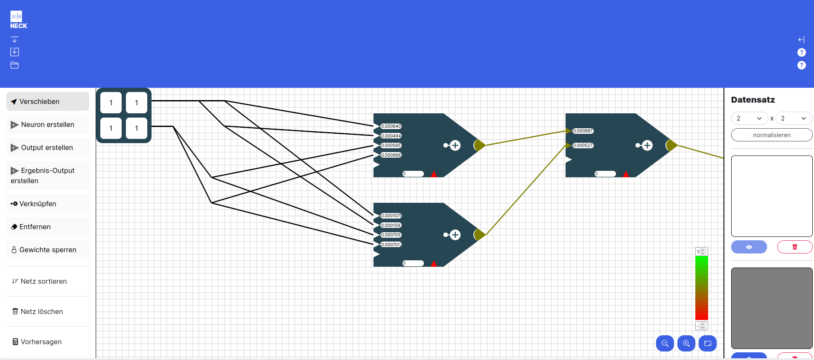
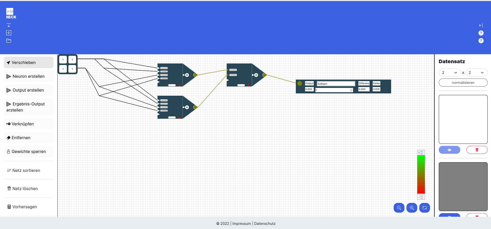

# Die Benutzeroberfläche

In der unteren Abbildung siehst du Benutzeroberfläche von NECK - dem Network Construction Kit!

Mit dieser Website lernst du spielend leicht die Grundlagen von Neuronalen Netzen die seit Jahren neue Spitzenleistungen erzielen. Egal ob Bild oder Spracherkennung - die Durchbrüche sind riesig.

## Die Oberfläche

Ein Neuronales Netz ist angelehnt an das menschliche Gehirn. In der Mitte der Website siehst du ein Gitterraster auf dem verschiedene Bausteine mit Linien verbunden sind.

#### Das Raster - erste Orientierung

In diesem Abschnitt werden nur die einzelnen Elemente auf dem Raster benannt. Die Elemente selbst werden in einem 
folgenden Abschnitt detailliert erklärt. 

Links oben ist eine **Eingabetabelle (Eingabematrix) **. In dieser Matrix sind Eingabedaten gespeichert mit denen dein neuronales Netz lernen soll. 

Diese Eingabetabelle ist mittels Linien mit **Neuronen** verbunden. Die Neuronen sind die Fünfecke mit den kleinen Textfeldern und der bunten Spitze. In der unteren Abbildung sind 3 Neuronen zu sehen. 

Rechts unten siehst du eine **Farbskala**. 

Unter der Farbskala sind **Zoom Knöpfe**.  Links für heraus, in der Mitte für reinzoomen. Mit dem rechten Knopf kommst du wieder zum Standardzoom zurück. 

Zoomst du heraus wirst du rechts neben den Neuronen auch einen **Ergebnis - Output (Ausgabe)** sehen. Mit Output ist das gesamte Rechteck gemeint.

