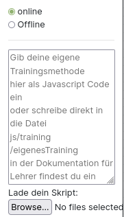
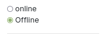

##### eigenes Verfahren laden

> ⚠️ Diesen Abschnitt brauchst du nur als absoluter Profi! 

Wenn du den Profi Modus aktiviert hast, kannst du in der Topbar bei Lernverfahren  "eigenes Verfahren" wählen. Dieses Verfahren kannst du in der linken Sidebar implementieren.

Zunächst lernst du wie du ein Skript lädst, erst danach lernst du wie du ein Skript schreibst. 

Befindest du dich im Online-Modus kannst du wie unten dargestellt den Code deines Skriptes einfach in das Textfeld einfügen oder eine Datei von deinem Computer auswählen in der das Skript enthalten ist. Diese Methode ist eigentlich nur sinnvoll, wenn du diese Website nicht lokal sondern über das Internet aufrufst. Eine Beispieldatei, die du im Online-Modus laden kannst findest du [hier](exampleScript.js) 

> ### Sollte beim Laden eines eigenen Skripts im Online Modus ein Fehler auftreten, lade zuerst die Website neu, gehe dann auf Skript laden, und wähle erst im letzten Schritt oben in der Topbar "eigenes Verfahren" aus. Das geladene Skript sollte in jedem Fall im Textfeld sichtbar sein!

Befindest du dich dagegen im Offline-Modus, so siehst du kein Textfeld mehr.

 Diesen Modus solltest du nur nutzen, wenn du die Website lokal aufrufst. Hier musst du kein Skript laden oder Code einfügen, sondern die Website nutzt automatisch das Skript in**js/training/eigenesTraining.js** Der große Vorteil dieser Methode ist, dass man in einem beliebigen Editor das Skript programmieren kann und es nur abspeichern muss. Anschließend nutzt die Website automatisch die neue Version des Skripts. Man spart sich das lästige Laden des neuen Programmiercodes. 

**Implementieren eines eigenen Lernverfahrens**

⚠️ Das Lernverfahren muss in reinem JavaScript geschrieben sein!

**1. Parameter** 

Dein Skript bekommt als Information die **layers** übergeben, d.h. es bekommt ein array mit, dass für jeden Layer wiederum ein array enthält mit den Neuronen des Layers. Dadurch hat man auch über die Neuronen Zugriff auf die Gewichte, auf die Eingabematrix (als Vorgänger der Neuronen des 0. Layers) und die Verknüpfungen zwischen den Neuronen (du kannst abfragen, wer der Nachfolger von welchem Neuron ist, ...) Auf die Ergebnis-Outputs kannst du zugreifen, indem du den Nachfolger der Neuronen des letzten Layers abfragst. Damit hast du alle Informationen die du benötigst. Außerdem bekommst du die aktuelle Rundennummer **roundnumber** und den Fehler der vorherigen Runde **oldError** um zu gucken, ob du dich im Training verbesserst. 

**2. Implementierung**

Wie du auf die einzelnen notwendigen Elemente für dein Training zugreifst siehst du im ExampleScript.js sehr gut. Das Skript funktioniert und implementiert das Random-Training. Die Funktion aller Methoden sollte anhand des Namens klar sein. Bei Fragen wende dich an deinen Lehrer - er hilft dir sicherlich gerne weiter! 

**3. Nutzung**

Kopiere am besten die Datei exampleScript.js und behalte sie immer als Orientierung. Verändere dann einzelne Codezeilen und probiere einfach rum! Was ist wenn du alle Gewichte einfach verdoppelst? Was wenn du alle Gewichte, bis auf eins sperrst und nur auf einem Gewicht trainierst? 

> Tipp: Drücke nach dem Laden deines Skripts F12 - sollte dort in der Console nicht stehen "starte Skript das aus externer Datei geladen wurde" so ist beim Laden deines Skriptes etwas schief gelaufen!
