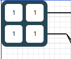
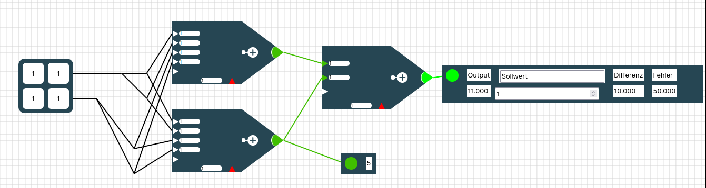

### Detaillierte Erklärung der einzelnen Elemente auf dem Raster

#### Eingabematrix

Die Eingabematrix/tabelle repräsentiert deine Trainingsdaten. Klickst du in ein Zahlenfeld der Eingabematrix, so kannst du dieses editieren/ verändern. Texte sind in der Eingabematrix nicht erlaubt. 

Ist das Verknüpfen-Werkzeug aktiviert kannst du mit einem Klick auf ein Zahlenfeld und anschließendem Klick auf ein Neuron dieses Eingabefeld mit dem Neuron verbinden. Ein Verbinden aller Eingabefelder mit einem Neuron auf einmal ist nicht möglich!

Du kannst ein Eingabefeld auch mehrmals mit dem gleichen Neuron verbinden. Das ist aber nicht zu empfehlen, da du auch einfach das Kantengewicht am Neuron verdoppeln kannst. (siehe Abschnitt Neuron) 

#### Neuron

Ein Neuron ist das wichtigste Element eines Neuronalen Netzes. Ein Neuron ist mittels Linien/Verknüpfungen mit anderen Neuronen und evtl. der Eingabematrix verbunden. Jede Verbindung transportiert den Ausgabewert des Vorgängers zu dem Nachfolger. Das heißt anfangs wird der Zahlenwert aus der Eingabematrix zu einem Neuron transportiert und von da aus zu anderen Neuronen bis es am Ergebnis-Output ankommt. Auf seinem Weg werden die Eingabedaten durch die Neuronen aber verrechnet um eine Vorhersage zu machen. 

Dafür wird jedes Eingabesignal, was jeweils über eine Verknüpfung/ Linie transportiert wird **gewichtet**. Diese Gewichtung gibt an mit welchem Wert der Zahlenwert auf der Leitung multipliziert wird. In der oberen Darstellung hat jede eingehende Linie ein Textfeld, die angibt mit welchem **Gewicht** das Eingangssignal gewichtet wird. Anschließend werden all die Werte aufaddiert und ergeben einen Zwischenwert.

Zu diesem Zwischenwert kommt je nach Einstellung ein Spezialwert, der sogenannte **Bias** der unten am Neuron dargestellt wird. Du kannst diesen Spezialwert in der linken Sidebar im Expertenmodus ein- und ausschalten. Je nachdem ob der Bias aktiviert ist, wird dieser angezeigt oder ausgeblendet. Der Bias ist einfach ein Datenkanal, der immer eine  *1* als Eingabe hat. Somit wird einfach der Bias zu dem vorher berechneten Zwischenwert addiert. Den Bias kann man sich wie eine Verschiebung einer Geraden um eine Konstante entlang der y-Achse vorstellen. Er ist von fundamentaler Bedeutung wenn man komplexe Probleme mittels neuronalen Netzen lösen will. (Frag gerne bei deinem Lehrer nach einer ausführlicheren Erklärung zum Thema Bias nach und lass es dir grafisch anhand eines 2-dimensionalen linear separierbaren Problems beschreiben, dass aber auf der y-Achse verschoben ist.)    

Der Zwischenwert (Gewichte * Eingabewerte +  Bias) wird mittels einer Ausgabefunktion abgewandelt  und anschließend von diesem Neuron zum Nachfolgeneuron geschickt. Das Aufaddieren aller Werte wird durch das "+" im Neuron dargestellt.  Ist der Ausgabewert des Neuron positiv, so wird die Spitze des Neurons grün gefärbt. Ist die Spitze des Neurons rot, so wird ein negativer Wert zurückgegeben. Sehr negative Werte werden in strahlendem rot dargstellt, weniger negative Werte eher in einem orange. Gleiches gilt für die positiven Werte in grün. Die Farbskala zur Darstellung der Werte kannst du im Raster links unten mit der **Farbskala** anpassen.  

##### Farbskala

Mit der Farbskala kannst du einstellen wie die Ausgaben der Neuronen eingefärbt werden. 

Positive Werte werden grün gefärbt, negative Werte rot. Je größer der absolute Ausgabewert eines Neurons  ist, desto intensiver wird die Neuronenspitze eingefärbt. An der Farbskala kannst du einen unteren und einen oberen Wert einstellen. Alle Ausgaben außerhalb dieses Intervalls werden ganz rot oder ganz grün eingefärbt. Es wird empfohlen die Farbskala so einzustellen, dass sie alle möglichen Ausgaben abdeckt, damit man Unterschiede sieht. 

#### Output und Ergebnis - Output

Ein Ergebnis-Output ist ganz rechts auf dem Raster zu sehen. Ein Ergebnis-Output ist ein Rechteck mit 4 Zahlenfeldern.

Der **Ergebnis-Output** enthält im **"Output"-Feld** die Ausgabe deines Netzwerk -  also deine Vorhersage zu deinen Eingabedaten. So sagt dein Neuronales Netz anhand deiner Eingabematrix ein Ergebnis voraus. Im Feld **"Sollwert"** steht der Wert den dein Neuronales Netz anhand deiner Eingabematrix normal vorhersagen sollte. 

> Anstatt "Sollwert" kann hier auch ein Label stehen, dass durch einen geladenen Datensatz festgelegt wurde.

Im Feld **"Differenz"** ist dann der Betrag von Output und Sollwert. Im Feld **"Fehler"** wird die gewählte Fehlermetrik auf die Differenz angewendet. Wie du im aller ersten Bild der Dokumentation siehst passt die Differenz und der Fehler nicht immer zu dem Output und Sollwert. Das liegt daran, dass diese Werte noch nicht aktualisiert wurden. Um die Eingabedaten wirklich in das Netz einzuspeisen und die richtige Ausgabe, die richtige Differenz und den richtigen Fehler angezeigt zu bekommen musst du  in der linken Leiste auf **Vorhersagen** klicken.

>  Der Ergebnis-Output ist also die Vorhersage deines Neuronalen Netzes!

Einen Output siehst du links unter dem Ergebnis-Output. Ein Output ist nur ein kleines Rechteck mit einem Farbpunkt und einem Zahlenfeld darin.

Ein **Output**  ist nur eine einzelne Zahl. Ihn kannst du mit Neuronen verbinden, um während des Trainings die Ausgaben der Neuronen, die über die Verknüpfungen wandern zu sehen. Ein Output wird dabei wie eine Neuronenspitze entsprechend der Farbskala eingefärbt. 
