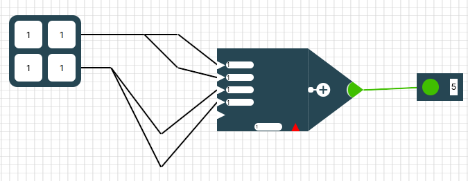

#### Die linke Sidebar - Werkzeuge

In der linken Sidebar findest du alles um dein Netz zu erstellen und zu verändern. Wenn du auf **Verschieben** klickst hast du dieses Werkzeug aktiviert. Klickst du auf ein

- die Eingabematrix
- ein Neuron 
- oder einen Output

und hälst die Maus gedrückt, so kannst du die Elemente beliebig auf dem Raster verschieben. Die Linien verschieben sich automatisch mit.

Klickst du auf **Neuron erstellen** aktivierst du damit dieses Werkzeug. Immer wenn du danach auf das Raster klickst erstellst du ein neues Neuron. Dieses Neuron ist aber noch nicht mit einem anderen Element auf dem Raster verbunden (also noch sinnlos).

> ⚠️ Wenn du mehrmals auf die gleiche Stelle klickst erstellst du jedes mal ein neues Neuron auch wenn du es nicht direkt siehst. Klickst du anschließend aber auf Verschieben wirst du merken, dass du mehrere Neuronen erstellt hast.

 Klickst du auf **Output erstellen** erstellst du mit jedem Klick auf das Raster einen Output.

Ein **Output** ist im Gegensatz zum Ergebnis-Output ein kleines Rechteck mit nur einer Zahl.

Im oberen Bild siehst du rechts ein kleines Rechteck mit einem grünen Kreis und einer 5 darin. Das ist ein Output. 

  

> ⚠️  Ein Output und ein Ergebnis Output sind unterschiedliche Elemente! Eine nähere Erklärung  zu den Elementen findest du im Abschnitt "Detaillierte Erklärung der Elemente"

Mit dem Button **Ergebnis-Output** erstellst du immer wenn du auf das Raster klickst einen Ergebnis-Output. (Ein Ergebnisoutput war das große Rechteck im zweiten Bild. Er enthält 4 Zahlen und ist deutlich größer als ein normaler Output)  

Mit dem Button **Verknüpfen** erstellst du **Linien** zwischen zwei Elementen auf dem Raster. Du kannst 

-  Eingabematrix - Neuron (nur diese Richtung)
- Neuron - Neuron
- Neuron - Output (nur diese Richtung
- Neuron - Ergebnis-Output (nur diese Richtung)

verbinden. 

Die Linie verläuft vom zuerst angeklickten Element zum zweit-angeklickten Element.

Dabei kann eine Eingabematrix mit mehreren Neuronen verbunden sein. Ein Neuron kann mit beliebig vielen anderen Neuronen verbunden sein. Aber es dürfen keine Kreise zwischen den Neuronen gebaut werden! Ein Neuron kann nur entweder mit einem Output oder mit einem Ergebnis-Output verbunden sein. Ein Output kann auch nur mit genau einem Neuron verbunden sein, genau so wie ein Ergebnis-Output. 

Willst du eine Eingabematrix mit einem Neuron manuell verbinden, so klickst du zuerst auf das Feld der Eingabematrix das du verbinden willst und dann auf das Neuron. Wichtig ist, dass du auf ein spezifisches Feld (eine Zahl in der Eingabetabelle) der Eingabematrix klicken musst. Du kannst nicht auf einmal eine ganze Matrix mit einem Neuron verbinden.  

> ⚠️ Achte auf die Reihenfolge beim Verbinden von Elementen. Kreise zu bauen wird vom Programm verboten.

Mit dem **Entfernen** Button aktivierst du dieses Werkzeug. Alles was du auf dem Raster anklickst wird gelöscht (außer der Eingabematrix - diese musst du in der rechten Sidebar löschen - siehe Abschnitt "rechte Sidebar").  Du kannst einzelne Linien zwischen den Elementen aber auch einzelne Neuronen, einzelne Outputs oder einzelne Ergebnis-Outputs löschen. 

Mit dem **Gewichte-Sperren** Button kannst du einzelne Gewichte von Neuronen sperren indem du sie anklickst. Diese Gewicht werden dann rot hinterlegt und werden beim Training nicht angepasst. Dies ist aber ein Werkzeug, dass du am Anfang wahrscheinlich nicht brauchst. 

Der **Netz-Sortieren** Button wird dein neuronales Netz automatisch schön übersichtlich sortiert. Die Eingabematrix wird nach ganz links verschoben und die Ergebnis-Outputs nach ganz rechts. Die Neuronen werden in verschiedenen Ebenen, sogenannten Layern angeordnet. Ist Neuron A mit Neuron B von A nach B mit einer Linie verbunden, so ist Neuron A links von Neuron B. Normale Outputs werden direkt neben ihr verbundenes Neuron verschoben. Elemente die nicht mit der Eingabematrix oder einem Ergebnis-Output verbunden sind werden automatisch gelöscht.

> ⚠️ Beachte, dass beim Netz sortieren unnötige Elemente gelöscht werden!

Mit dem **Netz löschen** Button löschst du alles (außer der Eingabematrix) auf dem Raster. Es werden also alle Neuronen, alle Outputs, alle Ergebnis-Outputs und alle Linien dazwischen gelöscht.

Mit dem  **Vorhersagen-Button** aktualisierst du die Ausgabe an den Ergebnis-Outputs. Manchmal kann es sein, dass du Werte in der Eingabematrix oder in den Neuronen von Hand änderst. Dann ändert sich  der Ergebnis-Output <u>nicht</u> automatisch mit. Klickst du jedoch auf den Vorhersage-Button wird alles richtig angezeigt. 

> ⚠️ Ganz am Anfang beim Öffnen der Website ist der Ergebnis Output nicht aktualisiert!
