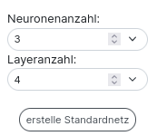

## Profi Modus

In der linken Sidebar ist ganz unten ein Schalter, mit dem du den **Profimodus einschalten** kannst. 

Unter diesem Schalter ist ein weiterer Schalter um den **Bias** ein- und auszuschalten.

Was der Bias ist und wofür du ihn brauchst steht im Abschnitt Neuron.

##### Datensatz laden

Um nicht immer alle Eingabematrizen über die Website mühsam erstellen zu müssen, kannst du diese auch aus einfachen csv-Dateien laden. Diese Datei muss jedoch eine spezifische Form haben. 

In der **ersten Zeile** stehen die **Bezeichner** der einzelnen Spalten. Im oberen Beispiel siehst du, dass es sich bei dem Datensatz um die logische Tabelle des xor handelt. In der **zweiten Zeile** folgen die **Dimensionen der Eingabematrizen**. Die erste Zahl steht für die Anzahl der Zeilen, die zweite Zahl für die Anzahl der Spalten der Eingabematrix. Im Beispiel handelt es sich bei der Eingabematrix also um eine Zeile mit zwei Spalten. Die dritte Zahl gibt die Anzahl der zu lernenden Ausgaben an. In dem Beispiel soll man anhand von zwei Variablen die Ausgabe des xor lernen - man hat also nur eine Ausgabe.

In den restlichen Zeilen ist in je einer Zeile eine Eingabematrix, wobei die Zeilen hintereinander gereiht werden und am Ende noch die ganzen Label angereiht werden.

(Für ein Auto mit den Eingaben PS, Preis, Anzahl Sitze, Gewicht könnte man die Maximalgeschwindigkeit und den Spritverbrauch vorhersagen wollen, die Label und die Dimensionen würden dann wie folgt aussehen:

PS, Preis, Anzahl Sitze, Gewicht, Maximalgeschwindigkeit, Spritverbrauch

2,2,2 oder 1,4,2)

Hat man eine csv-Datei in dieser Form, so kann man diese wie folgt laden:

-  Wähle mittels **Anzahl Datensätze** aus, wie viele der Datensätze aus der Datei geladen werden sollen (hat man eine Datei mit 100.000 Daten so empfiehlt es sich zum Testen kleinere Stichproben aus den Daten auszuwählen)
- Klicke auf das **Textfeld "Lade Datensatz hoch"** und wähle die Datei mit deinen Eingaben aus
- Klicke anschließend auf den Button **Hochladen** - erst dann werden die Matrizen auf der Website erstellt

> ⚠️ Ohne das Klicken auf Hochladen passiert nichts. 

##### Standardnetz erstellen 

Wie oben dargestellt kannst du Standardnetze erstellen. Das heißt, du kannst die Anzahl der Ebenen/ Layer und die Neuronenanzahl pro Layer festlegen. Mit dem Button "**erstelle Standardnetz**" wird dann das Netzwerk erstellt. Ohne klicken des Buttons passiert wie beim Datensatz laden nichts. 

 

Oben siehst du ein Standardnetz mit **Neuronenanzahl** 3, das heißt es sind 3 Neuronen pro Ebene. Außerdem hat das Netzwerk eine **Layeranzahl** von 4. Das heißt es gibt 4 Ebenen von Neuronen zwischen der Eingabematrix und dem Ergebnis-Output. In jeder Ebene sind 3 Neuronen (Neuronenanzahl viele), außer in der letzten Ebene. In der letzten Ebene sind so viele Neuronen, wie auch Ergebnis-Outputs da sind. Die Anzahl der Ergebnis-Outputs richtet sich nach der Anzahl der Vorhersagen, die durch die Matrizen definiert ist. 

Die Verbindungslinien sind im Standardnetz wie folgt:

- Jedes Feld der Eingabematrix ist mit jedem Neuron der ersten Ebene verbunden. 
- Jedes Neuron ist mit jedem Neuron der Folgeebene verbunden. 
- Jedes Neuron der letzten Ebene ist mit genau einem Ergebnis-Output verbunden.
- (Die Anzahl der Ergebnis-Outputs ist gleich der Anzahl die Eingabedaten festgelegt ist.)

##### Gewichte initialisieren

Für jedes Gewicht an den Neuronen gibt es eine Initial-/Anfangsbelegung. Diese anfängliche Belegung der Gewichte wird dabei völlig willkürlich gewählt. in der Praxis werden jedoch oft zufällige Gewichte nahe Null verwendet. Wenn du die Eingabematrix mit den Neuronen manuell verknüpfst, so wird initial als Gewicht eine 1 gesetzt. Willst du das ändern, gibt es verschiedene Möglichkeiten:

- du kannst in das Gewichtsfeld der Neuronen klicken und von Hand einen Wert eintragen
- du nutzt die Tools in der linken Sidebar

Um mit den Tools in der linken Sidebar die Gewichte der Neuronen vor dem Training zu initialisieren musst du zunächst angeben, aus welchem Bereich die Initialgewichte stammen sollen. Die Initialgewichte werden aus dem Intervall [min-Gewicht , max- Gewicht] *zufällig* gewählt. 

Klickst du auf den Button **initialisiere Gewichte der Neuronen** so initialisiert du die Gewichte *aller* Neuronen zufällig mit Zahlen aus dem gewählten Intervall. 

Klickst du auf den Button **Setzen der Gewichte eines Neurons** so hast du ein Werkzeug aktiviert, dass die Gewichte eines Neurons neu initialisiert, wenn du es anklickst. 

>  ⚠️ Willst du die Gewichte eines oder aller Neuronen auf eine feste Zahl setzen und nicht zufällig wählen, dann wähle min-Gewicht = max-Gewicht!

