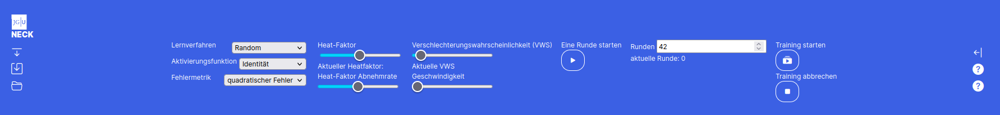

#### Die Topbar

Mit dem "**Pfeil nach unten**"-Button links oben kann man in den Einstellungsmodus der Topbar wechseln. Der **Speichern-Button** speichert das aktuelle Netz inklusive der Matrizen. Analog kann mit dem **Laden-Button** ein gespeichertes Netz geladen werden. 

Es gibt 3 verschiedene **Lernverfahren** zur Auswahl - "Random", "Backpropagation" und "eigenes Verfahren". Eigenes Verfahren ist jedoch nur im Profimodus auswählbar. Die **Aktivierungsfunktion** skaliert den Output der Neuronen. Nur im Profimodus kann man eine eigene Aktivierungsfunktion eingeben. Da für Backpropagation auch die Ableitung der Aktivierungsfunktion benötigt wird, muss diese bei der eigenen Aktivierungsfunktion auch mit eingegeben werden. 

- **Random**: Hier wird in jedem Trainingsdurchlauf ein zufälliges Gewicht angepasst. Ist der Fehler danach kleiner als vorher, wird die Veränderung akzeptiert. Ist es schlechter, wird es mit der **Verschlechterungswahrscheinlichkeit**, die du durch den Schieberegler einstellen kannst beibehalten. Der **Heat-Faktor** gibt an, wie groß die absolute Veränderung in einem Anpassungsschritt beträgt. Sowohl der **Heat-Faktor** als auch die **Verschlechterungswahrscheinlichkeit** sinkt während des Trainings. Dadurch wird am Anfang große Schritte gemacht um das Ergebnis grob in eine gute Richtung zu verändern und lokale Minima zu überwinden. Mit der Zeit werden die Werte immer kleiner, sodass am mit fortschreiten des Trainings eine Feinjustierung stattfindet.
- **Backpropagation**: Hier musst du nur die Lernrate mit einstellen. Diese gibt an wie groß die Änderungen der Gewichte in jedem Berechnungsschritt sind. Dabei steht als einzige Fehlermetrik nur der quadratische Fehler zur Auswahl. 
- **eigenes Verfahren**: Ist der Expertenmodus in der Seitenleiste aktiviert, kannst du auch ein eigenes Training starten. Wie du ein eigenes Training implementierst lernst du im Abschnitt **linke Sidebar**.

Ist der **Geschwindigkeit** Regler auf größer 0 eingestellt, läuft das Training verzögert ab und es werden Farben zur Animation und besserem Verständnis des Trainings eingesetzt.  Die Geschwindigkeit kann auch während des Trainings verändert werden und passt sich dann direkt an. 

Ein gestartetes Training kann jederzeit mit dem Button **Training abbrechen** abgebrochen werden. Hierbei bleiben die durch das Training gesetzte Werte bestehen und werden nicht zurückgesetzt. Dies ermöglicht es, anfangs beispielsweise 20 Runden zu trainieren, sich die Gewichte anzugucken und die Tendenz in der sie sich entwickeln und anschließend einfach mit den neu gelernten Gewichten weiter zu trainieren.

#### Animationsfarben

Beim Anpassen von Gewichten der Neuronen durch das Training werden diese gefärbt. Wurde er

-  kleiner wird er Pink eingefärbt, 

- größer wird er Hellgrün

-  und wenn er gleich bleibt Grau. 

- Bei Backpropagation werden alle geänderten Gewichte anschließend Gelb gefärbt.

Backpropagation läuft in dieser Implementierung in zwei Schritten ab [und orientiert sich an folgender Algorithmenskizze](backprop.png) (dies zeigt nur den Spezialfall sigmoider Aktiverungsfunktion und muss bei beliebiger Aktivierungsfunktion die Ableitung eben dieser nutzen statt des o_k* (1- o_k) )

1. Berechnung der deltas

2. Aktualisierung der Gewichte

Im ersten Schritt jedes Durchlaufs von Backpropagation muss für jedes Neuron ein δ berechnet werden. Dafür geht der Algorithmus von den Neuronen direkt an den Outputs (Outputneuronen) zu den Neuronen direkt an der Matrix (Versteckte Neuronen). Die dunkelblaue Farbgebung eines Neurons signalisiert, dass das δ dieses Neurons gerade berechnet wird. Die hellblau hinterlegten Neuronen (rechte Nachbarn) sind die, die für die Berechnung des δ des aktuellen Neurons benötigt werden.

Im zweiten Schritt werden die Gewichte aktualisiert. Dafür benötigt man die linken Nachbarn des Neurons. Das für das updaten eines Gewichts notwendige Vorgängerneuron wird orange eingefärbt. 

Wurde ein Gewicht geupdatet, wird es gelb eingefärbt.

>  Man kann also bei Backpropagation mit einer geeigneten Rundendauer das Verfahren sehr schön visuell nachvollziehen!
